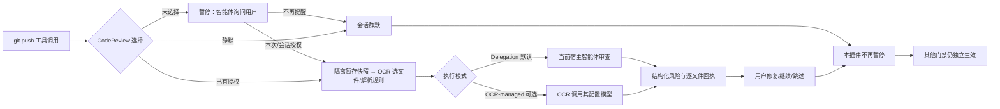

# CodeReview Plugin

提交前**可选授权**的语义代码审查插件，整合 Open Code Review（OCR）的正式 CLI 接口。
默认先问用户，拒绝后当前会话静默；审查报告是建议，不是强制通过门禁。

状态：`v0.3.0` push-only 拦截语义（push 阻断 / commit 提醒 / 其余放行）；v0.2.2 完成真实引擎与双模式审查验收（`ocr` v1.12.9，Delegation 与 OCR-managed 各一次真实全链路含真实模型调用），并修复真实契约漂移五处、固化真实输出契约测试。ZCode 与 Codex 已获真实 hook 运行证据（Codex 需先在 TUI 完成 hook 信任审查，否则钩子静默跳过）；Kimi 因本机无 Kimi Code CLI 未验。正式发布身份以 [GitHub Releases](https://github.com/full-stack-plugins/codereview-plugin/releases) 和 [Full Stack 插件市场](https://github.com/partme-ai/full-stack-plugins) 为准。

## 使用体验

**拦截语义（v0.3.0 起）**：只有 `git push` 会真正暂停等待授权；`git commit` 仅注入一条提醒上下文（不阻塞、不失败），其余 Git 命令（add / reset / status / log / fetch / checkout …）完全放行、零噪音。

第一次准备 push 时，智能体披露仓库、执行模式、实际推理方、模型（可知时）和代码范围，并提供：

- **仅本次审查**：同一逻辑提交的失败重试不重复授权；成功推送后结束。
- **当前会话自动审查**：只对同一会话、仓库/worktree、模型与外发策略有效；范围变化重新询问。
- **本会话不再提醒**：不主动审查、不再提醒；仍可手动审查一次，不解除静默。

没有回答不代表同意。审查发现问题后可修复重审、保留风险继续或跳过；不会自动编辑、提交、推送或替其他插件放行。



## 分工

| 插件 | 责任 | 本插件如何协作 |
| --- | --- | --- |
| FlowGuard | SDD 阶段、需求验收、用户豁免、最终裁决 | 只提供 evidence；不推进阶段 |
| CodeGuard | 编译、测试、规范及可执行检查 | 不重复实现这些检查 |
| CodeReview | 提交语义风险、授权、证据绑定 | 不把模型判断当强制通过 |

不要求回调先后顺序。首版交付[证据协议](docs/protocol.md)，不自动修改其他两个插件，也未实现跨插件统一调度。

## 技能来源与场景

插件分发 **8 个技能**：Alibaba OCR 官方两个技能、独立 [`codereview-skills`](https://github.com/full-stack-skills/codereview-skills) 五个增强技能，以及插件本地的 `codereview-harness`。外部七个由 [`skills.lock.json`](skills.lock.json) 固定到版本 tag、提交和逐技能摘要；只允许在来源仓修改。插件安装包自包含技能快照，不需要运行时再下载。

| 场景 | 入口 |
| --- | --- |
| AI 即将提交、询问仅本次/本会话/静默、审查暂存候选 | 本地 `codereview-harness`；始终先按本插件授权协议执行 |
| 用户主动审查工作区、分支、单提交，OCR 调用其配置模型 | 官方 `open-code-review`；这是独立手动审查，不继承提交授权 |
| 用户主动审查，由当前宿主模型执行 | 官方 `open-code-review-delegate`；OCR 只选文件和规则 |
| 跨模块需求/影响、发现核实、授权修复、项目规则、全文件扫描 | `codereview-context-impact`、`codereview-finding-triage`、`codereview-fix-verify`、`codereview-rules`、`codereview-scan` |

上游官方技能的工作区模式会覆盖暂存、未暂存和未跟踪文件，可能还包含安装 OCR 的通用指导。**提交前不得绕开本插件直接运行这些裸命令**；本插件不静默安装/升级 OCR，审查授权也不授权修复或外发到新端点。手动审查与提交审查的对象、授权和报告分别记录。

## 运行要求

- Python 3.11+、POSIX（macOS/Linux）；使用 `fcntl` 和进程组，Windows 原生未支持。WSL 需单独实测。
- Git 2.41+；已安装的 `ocr` 必须支持 `delegate preview/rule --format json`；OCR-managed 还必须支持 `review --output`。按能力探测，不固定单一版本。
- 默认 Delegation：OCR 只选择文件并解析规则，由当前 Codex/ZCode/Kimi 智能体审查，不要求 OCR 配置 LLM。可选 OCR-managed 才要求明确端点、模型与凭据。
- 双模式接口已在真实 `ocr` v1.12.9（npm 官方包 bccbc15）上完成真实审查验收。安装渠道支持 npm 官方包与 Homebrew（后者版本串无 `v` 前缀，已兼容识别）；同一台机器存在多份安装时以 PATH 解析为准，需排查旧副本遮蔽。`doctor` 仅探测命令能力，不执行 `ocr llm test` 或真实审查。
- 拦截边界：`git push` 暂停待授权；`git commit` 仅提醒不阻塞；其余 Git 命令直接放行。只支持普通暂存区提交、首次推送及显式 `git -C`。`-a`、amend、pathspec、复合命令、冲突/merge/rebase、符号链接、子模块、超限树返回受限状态，可明确跳过。
- 快照限制：基线与候选条目合计 5000、单 blob 4 MiB、去重 blob 总量 64 MiB；不截断后冒充完整审查。
- Hook 不是安全沙箱；Git 别名、动态脚本、宿主未覆盖的工具可能绕过。检查与实际提交间仍存在竞态窗口。

用户配置里的遥测开启在两种模式下都会被拒绝（遥测会外发宿主元数据并污染引擎输出流）；OCR-managed 还会拒绝自定义全局/项目规则、额外请求 headers/body 等不能确认外发边界的配置。插件不会擅自修改它们。Delegation 仍需用户授权，因为当前宿主智能体会读取隔离候选快照。详见[隐私](PRIVACY.md)。

## 开发验证

运行时仅 Python 标准库；测试需环境已有 pytest，以下命令不安装依赖、不调用模型：

```bash
python3 -m pytest -q
python3 scripts/validate_local.py
python3 scripts/vendor/skill_vendor.py check --offline
python3 scripts/vendor/skill_vendor.py check
openspec validate consent-based-review --strict
openspec validate integrate-codereview-skills --strict
```

CLI：

```bash
python3 scripts/codereview.py --help
python3 scripts/codereview.py prepare --request /absolute/private/request.json
```

请求字段见[CLI 协议](skills/codereview-harness/references/cli.md)。Delegation 的 `review` 只生成计划，宿主完成语义审查后必须调用 `complete-delegated`；OCR-managed 的 `review` 才由 OCR 调用模型。不要把测试夹具成功理解成真实模型成功。

## 安装、维护与验证边界

- [三端安装与卸载](docs/hosts.md)：目前只提供结构及操作说明，本轮未安装。
- [验收证据](docs/verification.md)：规格、测试、未完成项对应关系。
- [OpenSpec 授权变更](openspec/changes/consent-based-review/proposal.md) 与 [技能整合变更](openspec/changes/integrate-codereview-skills/proposal.md)：分别约束审查行为与外部技能分发；真实宿主验收前不归档为全部完成。
- 插件专属 `codereview-harness` 只声明在 `plugin-local-skills.json`，不进入 `skills.lock.json`。
- `.agents/skills/openspec-*` 是项目开发集成，不纳入分发技能清单；`.agents/plugins/marketplace.json` 是仓库级安装入口。

源码、测试和说明采用 Apache-2.0。上游 OCR 作为用户已有的外部程序调用，不打包其二进制。
