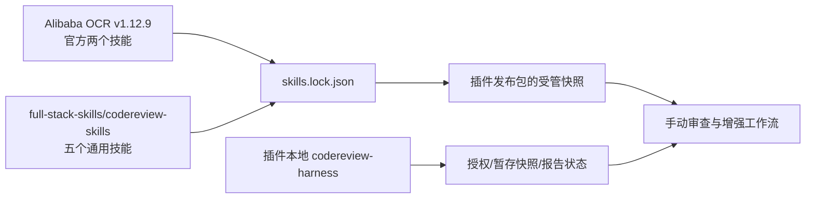

# Design

## 技能所有权

`skills.lock.json` 分别记录两个来源的不可变 tag、peeled commit、每技能摘要；`plugin-local-skills.json` 只列本地 harness。受管副本不直接编辑。发布包必须自包含，用户安装时不依赖再次联网获取技能。

## 入口路由

- **AI 即将提交**：只由 `codereview-harness` 的 `prepare → decide → review → report → disposition` 流程协调。官方技能可提供理解 OCR 模式的知识，但不能直接对真实工作区运行通用 `ocr review` 冒充候选快照审查。
- **用户主动审查工作区、分支或提交**：可使用上游 `open-code-review`（OCR-managed）或 `open-code-review-delegate`（宿主推理），但须先披露实际范围和推理方。其默认工作区范围含暂存、未暂存和未跟踪内容，不复用提交授权。
- **增强工作流**：`codereview-context-impact` 整理背景；`codereview-finding-triage` 核实发现；`codereview-fix-verify` 仅在修复授权下写代码；`codereview-rules` 仅在规则变更授权下写规则；`codereview-scan` 仅对显式同意的完整文件范围运行。

## 版本与校验

vendor 工具按两个来源抓取固定 tag，校验 peeled commit 与技能目录哈希；离线检查发布包完整性，在线检查 tag 未移动和内容未漂移。官方原文可能带有自动安装指导；本插件优先遵守其更严格的用户授权与不静默安装约束。上游升级必须重新审查冲突，并发新插件版本。

## 风险

- 上游通用技能与 harness 同时触发：通过清楚的 description 与路由文档规定提交前只走 harness；自动选择仍需真实宿主验收。
- 官方技能默认工作区范围过宽：不在候选提交路径直接调用，继续使用隔离快照内核。
- 技能数量增加但宿主不发现：分别验证 manifest、vendor 内容与实际宿主加载，后者本次若未执行须标记 UNVERIFIED。
