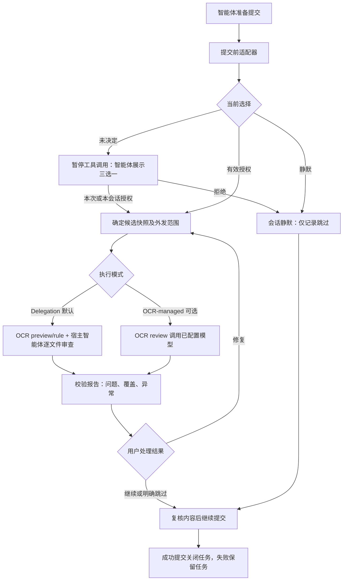

# Design

## Context

动机和产品范围见 [proposal.md](proposal.md)。当前目标目录只有新生成的 Codex 插件清单和 OpenSpec 集成，没有业务实现、测试、Git 仓库或远端地址。

本次只读发现：

- OpenSpec 1.13.1，使用 `spec-driven` schema；初始化生成 `.agents/skills/` 六个开发工作流技能。这些是开发工具，不是分发给用户的审查技能。
- OCR 位于 `/Users/wandl/.local/bin/ocr`，本机仍为 v1.6.5 (`0d601ea`)；上游 2026-09-22 发布 v1.12.9，正式提供 `review --output` 及 `delegate preview/rule --format json`。本机版本不能用于新版真实验收，且本变更不静默升级全局工具。
- 本机 `ocr --version` 和 `review --help` 的工具输出混有遥测资源文本；尚未分别验证 stdout/stderr 分布。没有运行模型审查，没有读取凭据。
- [上游 v1.6.5 输出实现](https://github.com/alibaba/open-code-review/blob/v1.6.5/cmd/opencodereview/output.go) 提供 `success`、`completed_with_warnings`、`completed_with_errors`、`skipped`；空 comments 可以为 null。结果可信度必须由适配器判断，不能仅依赖 CLI 文案。
- [上游 README](https://github.com/alibaba/open-code-review) 说明默认工作区审查含暂存、未暂存和未跟踪内容，不能直接用于精确提交审查。
- 现有插件分别使用 `.codex-plugin/plugin.json`、`.zcode-plugin/plugin.json`、`kimi.plugin.json` 和 `hooks/hooks.json`。这些本地惯例不能证明宿主实际支持的 Hook 协议；须单独验收。
- FlowGuard、CodeGuard 存在用户修改；本次完全不编辑它们。

## Goals / Non-Goals

**Goals:**

- 将确定性授权/证据管理放在 Python 内核，将对话推进留给宿主智能体。
- 让拒绝路径与允许路径同样完整；无引擎、审查失败、用户撤销均有可恢复出口。
- 本地核心测试不需要模型、凭据或网络；真实引擎和真实宿主测试单独标记。

**Non-Goals:**

- 不把 Hook 视为安全沙箱，也不保证恶意或任意包装的 Git 命令无法绕过。
- 不解析全部 Shell 语言，不擅自归一化 amend/merge/pathspec 的 Git 语义。
- 不接管 FlowGuard 的 SDD 状态，不复制 CodeGuard 静态检查，也不构造三套相互竞争的阶段流程。

## Decisions

### 1. 内核、协议适配与智能体技能分离

建议目录：

```text
codereview-plugin/
  .codex-plugin/plugin.json
  .zcode-plugin/plugin.json
  kimi.plugin.json
  hooks/hooks.json
  hooks/entry.py
  scripts/codereview.py
  codereview_core/
    consent.py         # 授权与逻辑任务
    store.py           # 原子状态与任务锁
    git_snapshot.py    # 候选内容与隔离快照
    engine.py          # OCR 调用与结果校验
    protocol.py        # 核心请求/响应
    hosts.py           # 分宿主输入输出适配
  skills/codereview/SKILL.md
  plugin-local-skills.json
  tests/
  docs/
  openspec/
```

插件标识暂定 `codereview-plugin`，与本次生成器的目录/清单一致；最终发布名称与组织地址不凭空构造。插件内只保留依赖本插件 CLI 的编排技能，并在本地技能清单声明；没有外部受管技能时不生成虚假的 `skills.lock.json`。

相比只写一个长 SKILL.md，这种分层能用测试验证授权和内容绑定；相比让 Hook 直接跑模型，它不会受 Hook 超时和交互环境限制。



图中的“继续提交”只表示 CodeReview 不再暂停；其他插件的独立门禁仍可阻止操作。

### 2. 会话偏好与一次提交任务是两层状态

会话偏好为 `ASK`、`AUTO_REVIEW`、`MUTED`。`MUTED` 覆盖同一宿主会话内的主动提醒；`AUTO_REVIEW` 还必须匹配授权范围，不能跨仓库或服务接收方继承。单次手动审查不隐式解除 `MUTED`。

任务状态建议为 `pending_choice → authorized → reviewing → completed / failed / skipped → committed / cancelled`。每个任务拥有稳定 UUID；重试不生成新任务。`completed` 表示产生审查证据，不是通过门禁。另存用户处置 `fix_and_retry / proceed_with_findings / skip`，不得和结果混淆。

授权范围包含宿主会话、真实仓库根、Git common-dir、worktree、执行模式、实际推理方、模型（可确定时）、上下文外发策略和配置摘要。Delegation 使用 `host-agent://<host>` 标识当前宿主推理，不要求 OCR API key；OCR-managed 使用实际 HTTP(S) 端点。只保留非敏感配置摘要，不落盘密钥。授权凭据引用宿主用户交互事件；CLI 是受信任的智能体协作接口，不提供防同用户恶意进程伪造授权的保证。

会话缺少可靠 ID 时，不使用固定 `default` 共享授权；进入显式单次手动模式并报告降级。新会话重置偏好，恢复同一会话保留状态。撤销使授权版本递增，阻止迟到任务将旧报告写成当前有效状态。

### 3. CLI 是统一编排接口

拟提供 `status`、`prepare`、`decide`、`review`、`result`、`proceed`、`skip`、`reset`、`doctor` 子命令，输出版本化 JSON。

- `prepare`：解析提交意图、创建/复用逻辑任务，返回 `ask_user / review_required / report_ready / allow / unsupported / error` 和明确原因。
- `decide`：记录用户三选一结果和披露范围；不直接调用模型。
- `review`：核对授权、版本、范围及锁后才调用引擎；相同任务相同候选内容的并发调用复用已有运行。
- `proceed`：记录用户对当前问题报告的明确继续决定，绑定该报告和候选内容。
- `skip`：明确放弃当前可选审查；不伪造报告。状态异常时仍提供任务级的显式跳过恢复流程，不要求删除全部会话数据。
- `doctor`：只检查依赖与协议能力，不输出密钥、不发起真实审查。

返回 `allow` 仅限本插件，不表示用户授予提交权。报告/CLI 输出作为不可信数据展示，禁止把内容当成新指令执行。

### 4. 精确快照：不在真实仓库创建中间提交

首版支持普通暂存区提交与首次提交。对 `git -C`、简单 `cd ... && git commit`、`git add ... && git commit` 等形式进行有界解析：前置暂存或路径变化要求智能体拆成独立工具调用，再审查最终索引。`git commit -a` 可提示先显式暂存，但不得未经用户意图确认重写命令。amend、merge 状态、pathspec、脚本包装、任意 shell 动态求值不声称已覆盖，返回受限能力与跳过出口。

快照包含基线 HEAD/空树、索引条目（mode/blob/path）和上下文清单；使用 NUL 分隔处理特殊文件名。候选树只从 Git 对象读取，不读取工作区新版本冒充暂存内容。

在私有临时 Git 仓库中建立基线和候选树，以合成提交供 `ocr review --commit` 使用；这些提交只存在于临时仓库。禁用临时仓库 Hooks、签名、外部 diff、smudge/clean 过滤器，不加载用户项目 Git 配置；不建立到原 `.git` 的可写链接。正常文件从 blob 构造，不执行源代码。源仓库 HEAD、索引和工作区全程保持不变。

审查上下文采用候选树中的已跟踪普通文件，披露“可能读取并发送仓库内必要上下文”，不承诺只发送 diff。拒绝冲突索引、越界路径、符号链接、子模块和超出限额的快照，给出原因。设置文件数、单文件和总字节限制；不通过静默截断来宣称完整覆盖。清理使用本次创建的临时目录对象，不对用户路径做递归删除。

提交前重新核验 HEAD、索引、规则/背景摘要；内容变化使报告和继续决定失效，但同任务同授权范围可以重审。Hook 检查与真实 Git 执行之间仍有竞态窗口，不宣传原子防篡改保障；需强保障时应另行设计 Git/server 侧门禁，而非本次偷偷安装 Git Hooks。

### 5. OCR 适配采用正式能力契约和双执行模式

不以精确版本等于 v1.6.5 作为唯一兼容条件。启动时以参数数组、不经 shell，探测 `delegate preview/rule --format json` 与 `review --output/--format/--audience/--preview`。探测只运行帮助/版本或 delegate 无 LLM 预览，不以 `ocr llm test` 作为未授权 doctor，因为它会产生真实模型请求。未知或缺失能力明确返回升级要求，不静默全局安装/升级。

默认 Delegation Mode：对隔离合成 commit 调用 `ocr delegate preview --format json`，再对全部 reviewable paths 调用 `ocr delegate rule --format json`。私有持久快照在宿主逐文件审查期间存活；宿主报告必须逐一覆盖 preview 文件，提交结构化 findings/coverage 后才清理。取消、跳过、reset、cleanup 与异常均回收本任务快照。此模式 OCR 端不调用 LLM，但用户仍需同意进行语义审查；源码会被当前宿主智能体读取。

可选 OCR-managed Mode：先 preview，再使用 `ocr review --format json --audience agent --output <私有唯一文件>`。结果只从该文件读取，限制大小并验证单个 JSON；stdout/stderr 仅作有界诊断且不进入报告。此模式解析实际 OCR 端点/模型用于授权披露，不能确定接收方时不得运行。

运行采用超时和进程组取消，结果与快照按 run ID 隔离。两种模式的内部报告都分开存储 `execution_status`、`coverage_status`、`findings`、`warnings`、`user_disposition`，不提供容易误解的 `passed: true`。

内部结果分开存储 `execution_status`、`coverage_status`、`findings`、`warnings`、`user_disposition`，不提供容易误解的 `passed: true`。保留上游严重性和类别原值，缺少字段时标记 unknown，不编造置信度。预览过滤清单与最终结果共同说明覆盖情况；统计数量不足以证明每个文件均已审查时必须写明覆盖证据有限。

### 6. Hooks 不依赖跨插件顺序

| 事件 | CodeReview 的职责 | 明确禁止 |
| --- | --- | --- |
| SessionStart | 恢复偏好，返回能力摘要 | 弹出审查问题、调用模型 |
| UserPromptSubmit | 可选的提交意图预识别和请求去重 | 仅凭自然语言就视为授权 |
| PreToolUse | 对真实提交检查选择、范围和报告 | 长时间审查、终端交互输入 |
| PostToolUse | 成功提交后校验 HEAD 并关闭任务 | 任意工具成功即消费单次授权 |
| Stop | 汇总本轮已发生审查 | 对已拒绝用户再次劝审 |

`UserPromptSubmit` 提示与 `PreToolUse` 必须使用同一任务标识；没有可靠关联时优先只在提交前创建请求，避免抢先弹窗。缺少强制暂停协议的宿主明确降级，不能靠复制其他宿主的返回 JSON 宣称兼容。

与 FlowGuard 的首版集成点是可读取的证据协议，而不是自动修改 FlowGuard。证据含版本、范围、任务、报告状态、跳过原因和用户决定。存在协调方时只让一个组件负责显示问题；协调方尚未支持此协议时，文档明确“不具备跨插件统一调度”。

### 7. 状态存储与故障恢复

默认存放于用户级状态目录（例如 XDG state 目录下的 `codereview-plugin`），测试可通过专用环境变量重定向。状态不进入 `.git` 或待提交源码。会话偏好与仓库任务分别键控，文件名由范围散列生成，不直接拼接用户路径。

使用私有目录权限、原子替换、进程锁和单调 revision。审查执行使用运行租约，进程异常退出后标记 abandoned，需要用户/智能体重试，不自动在后台再次发送代码。报告可能含源码，应私有保存并提供明确清理入口；默认不记录完整对话或环境变量。清理只删除插件自己的状态，不修改仓库。

## Risks / Trade-offs

- [模型漏报或误报] → 展示证据和覆盖局限，结果建议化，不能替代用户判断和确定性检查。
- [仓库内容提示注入] → 源码/报告作为数据，禁止据此授权、改变端点或执行命令。
- [快照上下文与工作区不同] → 优先提交内容一致性，明确报告范围，背景信息由用户/智能体明确选择并纳入摘要。
- [跨宿主协议差异] → 清单验证、事件夹具、真实宿主加载分别验收，不把前两项当作第三项。
- [本机 OCR 过旧或模型尚未配置] → Delegation 只要求新版 delegate 能力；OCR-managed 另需模型配置。离线测试用子进程夹具验证边界，真实运行标记未验证，不自动安装/外发。
- [用户权限下可修改状态] → 明确这是合作式 Harness，不是防恶意代理的安全边界。

## Migration Plan

1. 完成并校验本变更规划，用户确认后进入 apply。
2. 按任务清单先写失败测试，再实现内核、快照与引擎适配。
3. 完成三端适配文件和离线验收；不覆盖现有插件或宿主缓存。
4. 获得相应安装和外发授权后，分别完成真实引擎和三端宿主验收；否则保持明确未验证状态。
5. 发布、市场登记、远端仓库和版本 tag 作为用户后续明确授权的交付步骤，不在开发中隐式执行。
6. 回滚时禁用或卸载本插件即可停止其回调；没有安装 Git Hooks，无需重写用户仓库历史。
